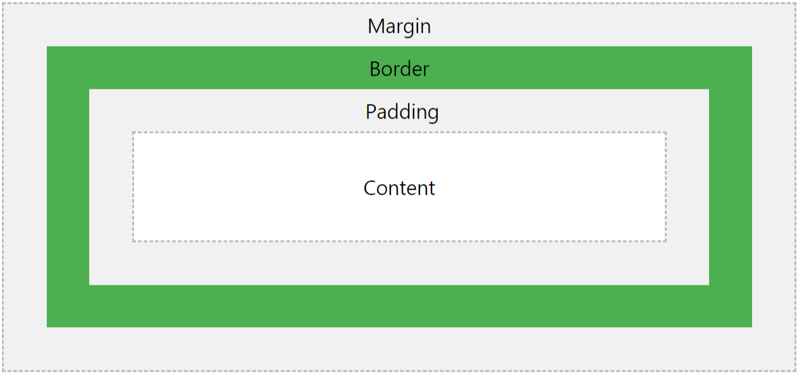

> # HTML (Hyper Text Markup Language)

- ### meta charset=”utf-8"

  A character in UTF8 can be from 1 to 4 bytes long. UTF-8 can represent any character in the Unicode standard. UTF-8 is backwards compatible with ASCII. UTF-8 is the preferred encoding for e-mail and web pages.

  컴퓨터는 언어를 숫자로 표현한다. 웹페이지에 영어가 아닌 언어가 쓰일 때 (예: 한국어, 중국어, 일본어) HTML 파일에 써줘야 하는 것! 이는 유니코드를 표현하는 인코딩 방식 중에 하나다. 웹페이지가 저장한 문자 표현 방식과 웹브라우저가 웹페이지를 해석하는 방법이 일치하지 않으면 이상한 문자를 표시한다.

  ***

- ### h1, h2, h3, h4, h5, h6

  The h1 to h6 tags are used to define HTML headings. h1 defines the most important heading. h6 defines the least important heading.

  하루에도 수백만 개, 수천만 개의 새로운 정보가 생겨난다. 무언가를 검색했을 때, 검색 엔진 상단에 노출이 잘 되게끔 하는 것! 프론트엔드 개발자라면 중요하게 생각해야할 요소 중 하나이다. 브라우저에서는 가장 먼저 태그를 확인하고 그에 맞게 기본(default) 스타일을 적용한다. 하지만 해당 태그나 class, id에 CSS 값이 있다면 해당 스타일을 더 우선순위로 적용하게 된다.

  ***

- ### &nbsp (Non-breaking Space)

  A non-breaking space is a space that will not break into a new line. Two words separated by a non-breaking space will stick together (not break into a new line). This is handy when breaking the words might be disruptive.

  자바스크립트에서는 스페이스바를 아무리 연속해서 써도 한번 밖에 적용되지 않는다. 이를 해결할 수 있는 것이 바로 이것이다. 스페이스바를 의미하는 코드라고 생각하면 된다. 예를 들어서 들여쓰기를 할 때 ‘&nbsp&nbsp’ 이렇게 연달아 입력하면 된다. 참고로 들여쓰기는 CSS에서 text-indent 프로퍼티를 사용해서도 가능하다.

  ***

> # CSS (Cascading Style Sheets)

- ### font family

  The font family property specifies the font for an element. The font family property can hold several font names as a "fallback" system. If the browser does not support the first font, it tries the next font.

  ( #title {font-family: Georgia, “Times New Roman”, Times, serif;} )

  사용자가 어떤 브라우저를 사용할지 모르기 때문에 최대한 여러 폰트를 나열하는 것! 가장 뒤에 위치한 serif 같은 폰트는 모든 브라우저에서 지원하는 폰트를 적는다.

  ***

- ### Margin, Border, Padding (CSS box model)

    </br>
    
    </br>
    * Content -> The content of the box, where text and images appear</br>
    * Padding -> Clears an area around the content. The padding is transparent</br>
    * Border -> A border that goes around the padding and content</br>
    * Margin -> Clears an area outside the border. The margin is transparent</br>
   
    ( {margin: 10px;} = { margin: 10px 10px 10px 10px;} = {위, 오, 아래, 왼} =
    {margin-top: 10px; margin-right: 10px; margin-bottom: 10px; margin-left: 10px;})
   
    밑줄을 쳐주는 스타일을 구현할 때! 자유롭게 원하는대로 커스터마이징을 위해서 ‘text-decoration: underline’ 대신에 ‘border-bottom’을 이용하면 밑줄의 두께나 색깔 등을 커스터마이징이 가능하다.
  ***

- ### CSS Selector

  - p.p-tag {} -> p 태그이면서, p-tag 클래스
  - p#third-line {} -> p 태그이면서, third-line 아이디
  - .pre span {} -> pre 클래스 안에 있는, span 태그
  - .a div .b .pre span {} -> a 클래스 안에, div 태그 안에, b 클래스 안에, pre 클래스 안에 있는, span 태그
  - div .container li.first-list {} -> div 태그 안에, container 클래스 안에, li 태그이면서, first-list 클래스

  Selector Priority : tag <<<<< class <<<< id <<<<<< inline css

  attribute인 placeholder를 css의 selector로 표현하기 위해서는 콜론 두개를 붙여서 selector를 만들어줄 수 있다. 하지만 attribute를 표현한다고 모두 콜론을 쓰는 것은 아니다.

  ```
  ( input::placeholder {} )
  ```

  ***

- ### Block vs Inline

  - Block 요소 예시 : header, footer, p, li, table, div, h1 등 대부분의 HTML element
  - Inline 요소 예시 : span, a, img 등

  CSS를 이용해서 Block 요소 성질을 가진 Inline 요소, Inline 요소 성질을 가진 Block 요소를 만들 수 있다.

  ```
  .inline-p {display: inline-block;} inline 성질을 가진 p 태그
  .block-span {display: block;} block 성질을 가진 span 태그
  ```

  ***

- ### The position property

  - fixed :</br>
    An element with position: fixed; is positioned relative to the viewport, which means it always stays in the same place even if the page is scrolled. The top, right, bottom, and left properties are used to position the element. A fixed element does not leave a gap in the page where it would normally have been located.</br>
    </br>
    페이지가 스크롤되더라도 늘 같은 곳에 위치하게끔 설정할 때 사용한다.

  - relative :</br>
    An element with position: relative; is positioned relative to its normal position. Setting the top, right, bottom, and left properties of a relatively-positioned element will cause it to be adjusted away from its normal position. Other content will not be adjusted to fit into any gap left by the element.</br>
    </br>
    상대 위치가 지정된 엘리먼트에 top이나 right, bottom, left를 지정하면 기본 위치와 다르게 위치가 조정된다. 다른 콘텐츠는 해당 엘리먼트에서 남긴 공백에 맞춰 들어가게끔 조정되지는 않는다.

  - absolute :</br>
    An element with position: absolute; is positioned relative to the nearest positioned ancestor (instead of positioned relative to the viewport, like fixed). However; if an absolute positioned element has no positioned ancestors, it uses the document body, and moves along with page scrolling.</br>
    </br>
    가장 가까운 곳에 위치한 조상 엘리먼트에 상대적으로 위치가 조정된다는 점을 제외하면 fixed와 비슷하게 동작한다. 참고로 상대적으로 위치가 조정되게끔 지정된 엘리먼트는 position: static;인 경우를 제외하고 정해진다.

  ***

- ### Display: inline-block

  Compared to display: inline, the major difference is that display: inline-block allows to set a width and height on the element. Also, with display: inline-block, the top and bottom margins/paddings are respected, but with display: inline they are not. Compared to display: block, the major difference is that display: inline-block does not add a line-break after the element, so the element can sit next to other elements.

  간단하게 말해서 Inline 요소 성질을 가진 Block 요소라고 할 수 있다. 예시로 .inline-p {display: inline-block;} 은 inline 성질을 가진 p 태그이다.

  ***

- ### float

  The float property specifies how an element should float.

  float은 이미지 주위를 텍스트로 감싸기 위해 만들어진 것이다. 포지션이 절대적인 경우에는 float을 무시한다. float요소를 사용할 경우 그 다음 요소는 float요소 위에 뜨게 된다. 이 경우에는 clear속성 또는 clearfix 핵을 사용하면 된다. 예시로 .box {clear: left;}를 할 경우 box 클래스를 가진 엘리먼트 왼쪽은 비워준다.

  ***
