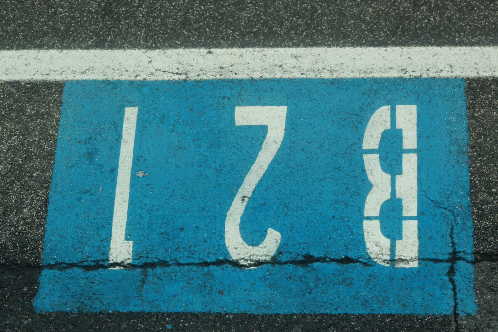

- ### 문제

  숫자인 num을 인자로 넘겨주면, 뒤집은 모양이 num과 똑같은지 여부를 반환해주세요.

  num: 숫자</br>
  return: true or false (뒤집은 모양이 num와 똑같은지 여부)

  예를 들어,

  ```
  num = 123
  return false
  => 뒤집은 모양이 321 이기 때문
  ```

  ```
  num = 1221
  return true
  => 뒤집은 모양이 1221 이기 때문
  ```

  ```
  num = -121
  return false
  => 뒤집은 모양이 121- 이기 때문
  ```

  ```
  num = 10
  return false
  => 뒤집은 모양이 01 이기 때문
  ```

  ***

- ### 나의 코드

  - Solution 1

  ```
  const sameReverse = num => {
    let strN = String(num);
    let strNArr = strN.split("");
    let revStrNArr = strNArr.reverse();
    let revN = revStrNArr.join("");
    return revN;
  }
  ```

  - Solution 2

  ```
  const sameReverse = num => {
    let revNum = Array.from(String(num)).reverse().join("");
    if (String(num) === revNum) {
      return true;
    } else {
      return false;
    }
  }
  ```

        console.log(sameReverse(123));</br>
        //expected output : false => 뒤집은 모양이 321 이기 때문</br>
        console.log(sameReverse(1221));</br>
        //expected output : true => 뒤집은 모양이 1221 이기 때문</br>
        console.log(sameReverse(-121));</br>
        //expected output : false => 뒤집은 모양이 121- 이기 때문</br>
        console.log(sameReverse(10));</br>
        //expected output : false => 뒤집은 모양이 01 이기 때문
