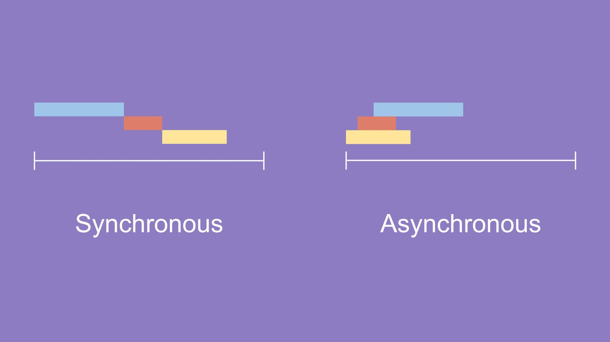

동기와 비동기의 차이는 요청과 응답이 이루어지는 시간대의 차이로 구분할 수 있다.

- 동기 => 요청을 하는 시기 === 응답을 하는 시기

  요청이 이루어진 후에 응답이 끝날 때까지 코드의 연산을 멈춘다.
  완전히 응답을 받고 나면 다시 요청이 이루어진다.
  요청과 응답이 동시에 이루어져야 한다.
  응답까지 대기시간이 필요할 수 있다.
  설계가 매우 간단하고 직관적이다.

- 비동기 => 요청한 내용은 언젠가 응답해 줄 것이라는 약속

  요청과 응답이 동시에 이루어질 필요가 없다.
  요청과 응답이 다른 시간대에 존재하기 때문에, 요청에 대한 응답이 구지 바로 이루어질 필요가 없다.
  응답까지 시간이 걸리더라도 그 사이에 다른 작업이 가능하다.
  요청과 응답의 결합이 자유롭기 때문에, 프로그램이 응답을 위한 대기하지 않고 다음 로직을 수행한다.

* 동기의 예1)
  

      1. A는 B에게 10,000원 입금 예정
      2. A는 B에게 10,000원 송금
      3. B는 10,000원 입금 인지
      4. A에게 10,000원 입금 인지 알림
      5. A와 B 각각 차감과 증가가 동시에 발생

      --- 서로의 응답과 요청을 1~4 확인한 후, 같은 일 동시에 진행(5번) ---

* 동기의 예2)

코드가 위에서부터 아래로
1st
2nd
3rd
4th
5th
차례대로 찍힌다. 하나가 끝나면 다음 코드가 실행되는 방식.

- 비동기의 예1)
  

      1. 학생 시험문제 풀이
      2. 시험문제를 모두 푼 학생 선생님에게 전송
      3. 선생은 학생의 시험지를 채점
      4. 채점이 다 된 시험지를 학생에게 전송
      5. 학생은 선생이 전송한 시험지를 받아 결과 확인

      --- 학생은 시험지 풀이, 선생은 채점, 서로의 목적이 다르므로 작업처리시간 일치 불필요 ---

* 비동기의 예2)

setTimeout() 메소드를 사용했다. 첫번째 인자는 콜백함수, 두번째 인자는 지연시간이다.
두번째 인자가 0이니까 과연 바로 실행될 것인가. 아니다.
1st
3rd
4th
5th
2nd
순서로 찍힌다. setTimeout()은 비동기적 메소드이기 때문에, 동기적 코드 반환 완료 후 반환.

자바스크립트에서 비동기 처리가 필요한 이유를 생각해보자.
화면에서 서버로 데이터를 요청했을 때 서버가 언제 그 요청에 대한 응답을 줄지도 모르는데 마냥 다른 코드를 실행 안 하고 기다릴 순 없다. 만약 100개의 요청을 보낸다고 생각해보자. 비동기 처리가 아니고 동기 처리라면 코드 실행하고 기다리고, 실행하고 기다리고... 아마 웹 애플리케이션을 실행하는데 수십 분은 걸릴 것이다.
