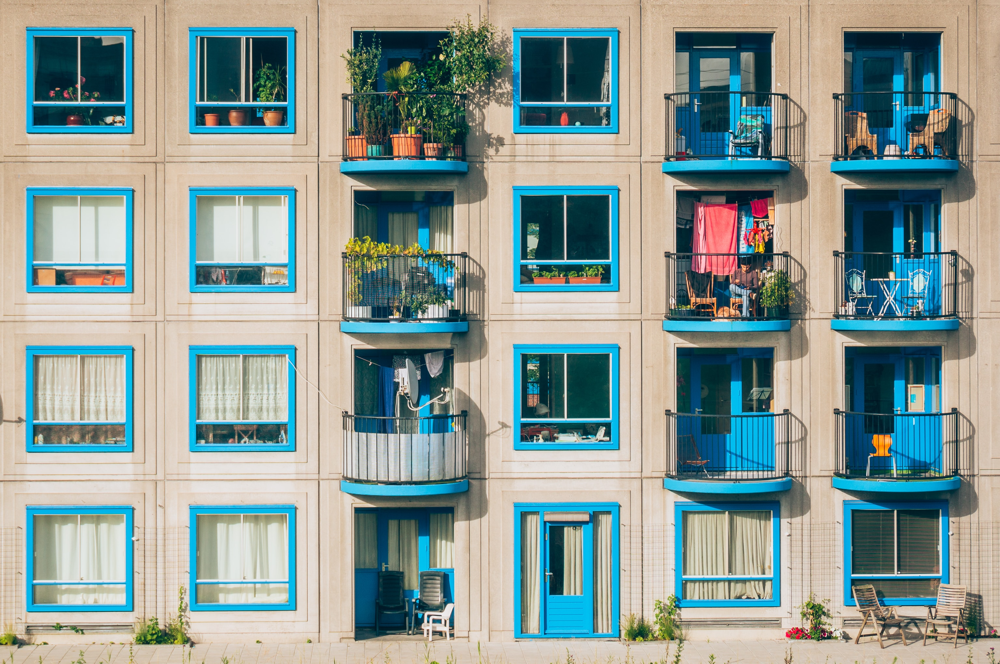

```html
<!DOCTYPE html>
<html lang="en">
  <head>
    <meta charset="UTF-8" />
    <meta name="viewport" content="width=device-width, initial-scale=1.0" />
    <meta http-equiv="X-UA-Compatible" content="ie=edge" />
    <title>CSS Grid</title>
    <style>
      .father {
        display: grid;
        grid-template-rows: 300px 120px; // 행, height
        grid-template-columns: 300px 150px; // 열, width
        grid-gap: 5px; // 간격
        grid-auto-rows: 60px;
      }
      .box {
        background-color: #f1c40f;
      }
    </style>
  </head>
  <body>
    <div class="father">
      <div class="box"></div>
      <div class="box"></div>
      <div class="box"></div>
      <div class="box"></div>
      <div class="box"></div>
      <div class="box"></div>
      <div class="box"></div>
      <div class="box"></div>
      <div class="box"></div>
    </div>
  </body>
</html>
```


```html
<!DOCTYPE html>
<html lang="en">
  <head>
    <meta charset="UTF-8" />
    <meta name="viewport" content="width=device-width, initial-scale=1.0" />
    <meta http-equiv="X-UA-Compatible" content="ie=edge" />
    <title>CSS Grid</title>
    <style>
      .father {
        display: grid;
        grid-template-rows: 300px 120px;
        grid-template-columns: 300px 150px;
        grid-gap: 5px;
        grid-auto-columns: 60px;
        grid-auto-flow: column;
        /* it is similar as flex-direction in flexbox. and default value is row */
      }
      .box {
        background-color: #f1c40f;
      }
    </style>
  </head>
  <body>
    <!-- when input ".father>.box*6", output as below -->
    <div class="father">
      <div class="box"></div>
      <div class="box"></div>
      <div class="box"></div>
      <div class="box"></div>
      <div class="box"></div>
      <div class="box"></div>
      <div class="box"></div>
      <div class="box"></div>
      <div class="box"></div>
    </div>
  </body>
</html>
```
