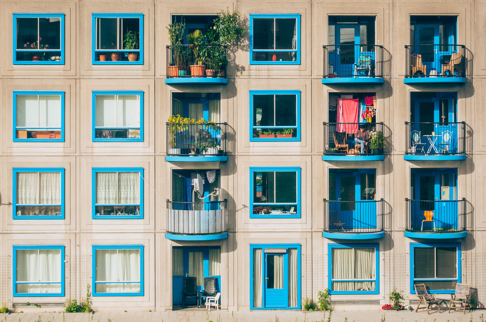

```html
<!DOCTYPE html>
<html lang="en">
  <head>
    <meta charset="UTF-8" />
    <meta name="viewport" content="width=device-width, initial-scale=1.0" />
    <meta http-equiv="X-UA-Compatible" content="ie=edge" />
    <title>CSS Grid</title>
    <style>
      .father {
        display: grid;
        grid-gap: 10px;
        grid-auto-rows: 100px;
        grid-template-columns: repeat(5, 100px);
        color: white;
        height: 100vh;
        justify-items: center;
      }
      .box:nth-child(even) {
        background-color: #3498db; /* light blue colour */
      }
      .box:nth-child(odd) {
        background-color: #34495e; /* dark blue colour */
      }
    </style>
  </head>
  <body>
    <div class="father">
      <div class="box">1</div>
      <div class="box">2</div>
      <div class="box">3</div>
      <div class="box">4</div>
      <div class="box">5</div>
    </div>
  </body>
</html>
```


```html
<!DOCTYPE html>
<html lang="en">
  <head>
    <meta charset="UTF-8" />
    <meta name="viewport" content="width=device-width, initial-scale=1.0" />
    <meta http-equiv="X-UA-Compatible" content="ie=edge" />
    <title>CSS Grid</title>
    <style>
      .father {
        display: grid;
        grid-gap: 10px;
        grid-auto-rows: 100px;
        grid-template-columns: repeat(5, 100px);
        color: white;
        height: 100vh;
        align-items: center;
      }
      .box:nth-child(even) {
        background-color: #3498db; /* light blue colour */
      }
      .box:nth-child(odd) {
        background-color: #34495e; /* dark blue colour */
      }
    </style>
  </head>
  <body>
    <div class="father">
      <div class="box">1</div>
      <div class="box">2</div>
      <div class="box">3</div>
      <div class="box">4</div>
      <div class="box">5</div>
    </div>
  </body>
</html>
```


```html
<!DOCTYPE html>
<html lang="en">
  <head>
    <meta charset="UTF-8" />
    <meta name="viewport" content="width=device-width, initial-scale=1.0" />
    <meta http-equiv="X-UA-Compatible" content="ie=edge" />
    <title>CSS Grid</title>
    <style>
      .father {
        display: grid;
        grid-gap: 10px;
        grid-auto-rows: 100px;
        grid-template-columns: repeat(5, 100px);
        color: white;
        height: 100vh;
        place-items: end center;
      }
      .box:nth-child(even) {
        background-color: #3498db; /* light blue colour */
      }
      .box:nth-child(odd) {
        background-color: #34495e; /* dark blue colour */
      }
    </style>
  </head>
  <body>
    <div class="father">
      <div class="box">1</div>
      <div class="box">2</div>
      <div class="box">3</div>
      <div class="box">4</div>
      <div class="box">5</div>
    </div>
  </body>
</html>
```
